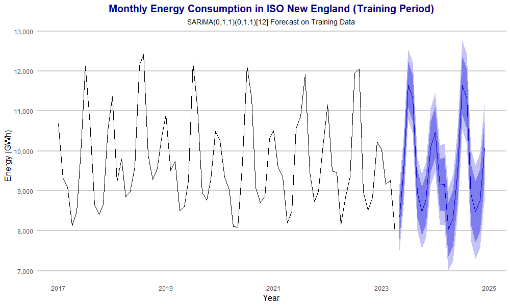

# Time Series Forecasting of Electricity Demand

This project forecasts monthly Non-Peak Time Frame (Non-PTF) electricity demand for the ISO New England region using the Box-Jenkins methodology. Using public electricity demand data from January 2017 to December 2024, the project develops and evaluates a seasonal time series forecasting model, comparing its performance against a classical exponential smoothing baseline. Model performance is assessed using MAE, RMSE, and MAPE, with the selected SARIMA model achieving the highest forecasting accuracy while effectively capturing seasonal demand patterns.

  

## Models

- SARIMA(0,1,1) × (0,1,1)₁₂
- Holt-Winters Exponential Smoothing (Additive)

## Future Improvements

- Incorporate exogenous variables such as temperature and economic indicators using SARIMAX.
- Explore advanced forecasting approaches such as Prophet and LSTM models.
- Evaluate model performance over longer forecasting horizons.

## Course

MA 585 - Time Series and Forecasting
Boston University
